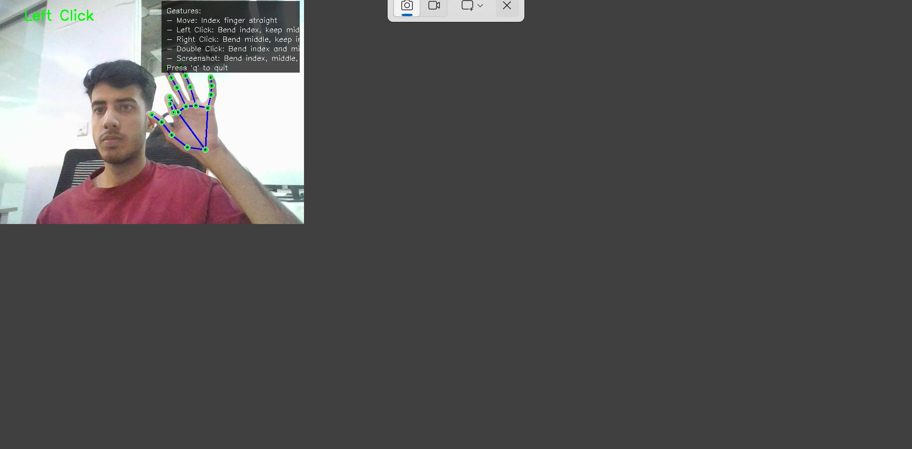
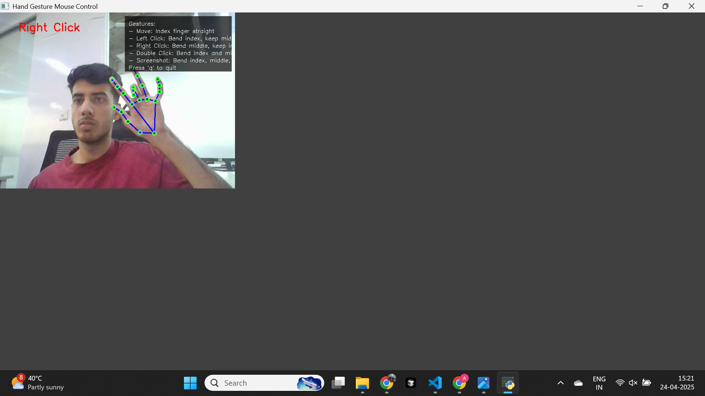
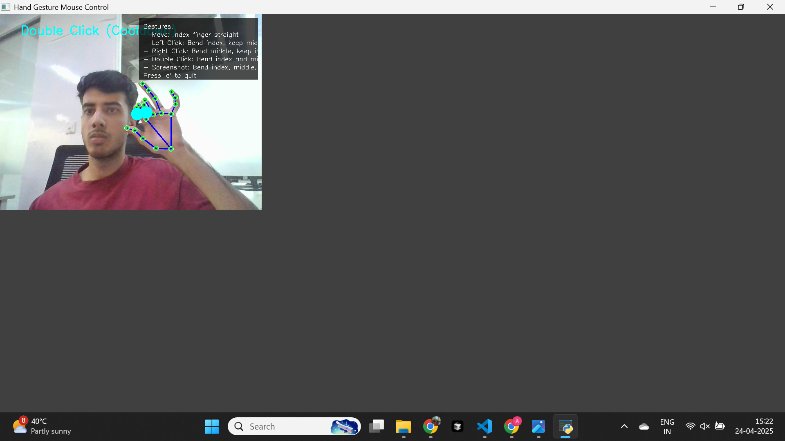
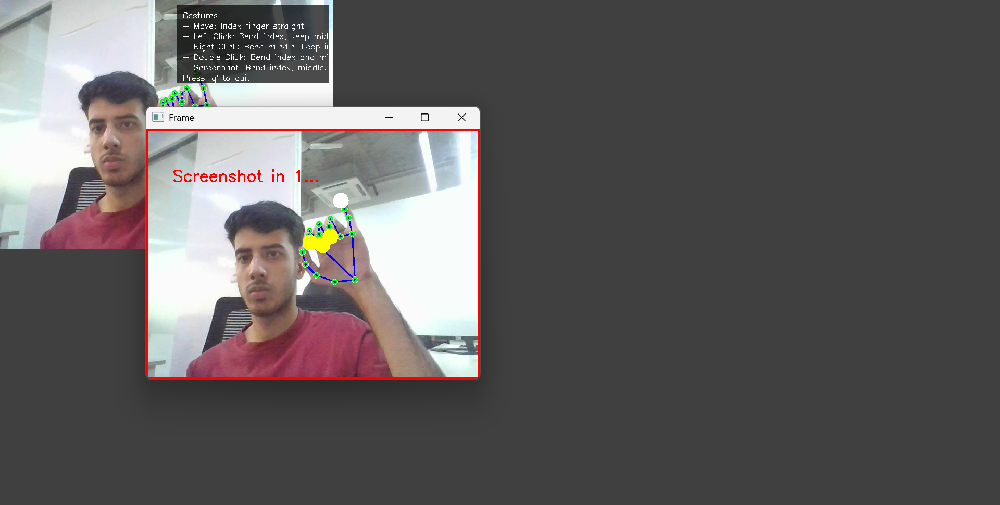

# Hand Gesture Mouse Control

[](https://github.com/Akshan03/Virtual-Mouse)

This application allows you to control your mouse cursor using hand gestures captured through your webcam. It uses computer vision and machine learning to detect hand landmarks and translate them into mouse actions.

> **GitHub Repository**: [https://github.com/Akshan03/Virtual-Mouse](https://github.com/Akshan03/Virtual-Mouse)

## Table of Contents
- [Gesture Guide](#gesture-guide)
  - [Mouse Movement](#mouse-movement)
  - [Left Click](#left-click)
  - [Right Click](#right-click)
  - [Double Click](#double-click)
  - [Screenshot](#screenshot)
- [How It Works](#how-it-works)
- [Key Features](#key-features)
- [Getting Started](#getting-started)
- [Tips for Best Performance](#tips-for-best-performance)
- [Troubleshooting](#troubleshooting)
- [Technical Implementation](#technical-implementation)
- [Future Improvements](#future-improvements)
- [Contributing](#contributing)
- [License](#license)

## Gesture Guide

### Mouse Movement
- **Gesture**: Point with your index finger
- **Description**: Keep your index finger extended and move your hand to control the cursor position
- **Tip**: For more precise control, move your hand slowly

### Left Click

- **Gesture**: Bend your index finger while keeping your middle finger straight
- **Description**: Similar to pressing down with your index finger
- **Visual Feedback**: Green circle appears on your index fingertip
- **Effect**: Performs a single left mouse click

### Right Click

- **Gesture**: Bend your middle finger while keeping your index finger straight
- **Description**: The opposite of the left click gesture
- **Visual Feedback**: Red circle appears on your middle fingertip
- **Effect**: Performs a single right mouse click

### Double Click

- **Gesture**: Bend both index and middle fingers while keeping your ring finger straight
- **Description**: Like making a "peace sign" but bending both fingers down
- **Visual Feedback**: Yellow circles appear on both index and middle fingertips
- **Effect**: Performs a double-click action
- **Note**: Has a cooldown period to prevent accidental multiple double-clicks

### Screenshot

- **Gesture**: Bend index, middle, and ring fingers while extending your pinky finger
- **Description**: Like making a "phone call" gesture
- **Visual Feedback**:
  - Cyan circles on index, middle, and ring fingertips
  - White circle on pinky fingertip
  - Connecting lines between fingertips
- **Effect**:
  - 3-second countdown with visual overlay
  - Screen flash when screenshot is taken
  - Saves image with timestamp filename

## How It Works

This application uses:
- **MediaPipe**: For hand landmark detection (21 points on each hand)
- **OpenCV**: For image processing and visualization
- **PyAutoGUI**: For controlling mouse movements and taking screenshots
- **Pynput**: For precise mouse click control

The system:
1. Captures video from your webcam
2. Detects hand landmarks in each frame
3. Analyzes finger positions and angles
4. Recognizes specific gestures based on finger configurations
5. Translates these gestures into mouse actions

## Key Features

### Visual Feedback System
- **Color-coded indicators**: Different colors for different gestures
- **Fingertip highlighting**: Circles appear on relevant fingertips
- **On-screen text**: Shows which gesture is detected
- **Connecting lines**: Visualize finger positions for complex gestures
- **Help text overlay**: Always visible gesture guide

### Intelligent Gesture Detection
- **Angle-based detection**: Measures angles between finger joints
- **Multiple detection methods**: For more reliable recognition
- **Cooldown periods**: Prevents accidental multiple actions
- **State tracking**: Remembers previous gestures

### Enhanced Screenshot Capability
- **Dual detection methods**:
  - Traditional method: Checks if three fingers are bent and pinky is extended
  - Relative method: Checks if pinky is significantly more extended than other fingers
- **Visual countdown**: Large centered countdown with semi-transparent overlay
- **Screen flash effect**: Visual confirmation when screenshot is taken
- **Smart naming**: Automatic timestamped filenames (e.g., `screenshot_20240621-123456.png`)

## Getting Started

### Requirements
- Python 3.7+
- Webcam
- Required libraries:
  - OpenCV (`opencv-python`)
  - MediaPipe
  - PyAutoGUI
  - Pynput

### Installation

```bash
# Install all required dependencies
pip install opencv-python mediapipe pyautogui pynput
```

### Running the Application

1. Clone the repository:
   ```bash
   git clone https://github.com/Akshan03/Virtual-Mouse.git
   ```
2. Navigate to the project directory:
   ```bash
   cd Virtual-Mouse
   ```
3. Run the application:
   ```bash
   python main.py
   ```
4. Position your hand in front of the webcam
5. Use the gestures shown in the guide above
6. Press 'q' to quit the application

## Tips for Best Performance

### Hand Positioning
- **Distance**: Keep your hand 1-2 feet from the camera
- **Angle**: Palm facing the camera works best
- **Framing**: Ensure your entire hand is visible in the frame
- **Movement**: Make deliberate, clear gestures and hold briefly

### Environment
- **Lighting**: Bright, even lighting improves detection
- **Background**: Simple, uncluttered backgrounds work best
- **Contrast**: Your hand should stand out from the background
- **Camera**: Higher resolution webcams provide better detection

### Gesture Tips
- **Left/Right Click**: Exaggerate the finger bend for better detection
- **Double Click**: Keep ring finger clearly extended
- **Screenshot**: Make sure pinky is prominently extended
- **Movement**: For precise control, move slowly and steadily

## Troubleshooting

### Gesture Not Recognized
- Make more exaggerated gestures
- Check lighting conditions
- Ensure your hand is fully visible
- Try adjusting your distance from the camera
- Make sure all fingers are clearly visible

### Application Issues
- Verify webcam is working properly
- Check that all required libraries are installed
- Ensure no other applications are using your webcam
- Try restarting the application

## Technical Implementation

### Hand Landmark Detection
The application uses MediaPipe's hand tracking solution which provides 21 3D landmarks of a hand:
- 4 landmarks for each finger (tip, DIP, PIP, MCP joints)
- 1 landmark for the wrist

### Gesture Recognition Logic
- **Angle Calculation**: We calculate angles between finger joints to determine if fingers are bent or straight
- **Distance Measurement**: We measure distances between landmarks (e.g., thumb to index tip)
- **Threshold-Based Detection**: Specific angle and distance thresholds determine which gesture is recognized

### Optimization Techniques
- **Smoothing**: Cursor movement is smoothed to reduce jitter
- **Cooldown Periods**: Prevents rapid, accidental gesture triggers
- **Visual Feedback**: Helps users understand which gesture is being detected
- **Dual Detection Methods**: For more reliable recognition of complex gestures

## Future Improvements

### Potential Enhancements
- **Customizable Gestures**: Allow users to define their own gestures
- **Gesture Calibration**: Adapt to individual hand sizes and movement patterns
- **Additional Actions**: Support for drag-and-drop, scrolling, and keyboard shortcuts
- **Multi-Hand Support**: Use both hands for more complex interactions
- **Accessibility Features**: Adapt for users with limited mobility

### Performance Optimizations
- **Reduced CPU Usage**: Optimize processing for lower-end hardware
- **Better Tracking**: Improve hand detection in challenging lighting conditions
- **Faster Response**: Reduce latency between gesture and action

## Contributing

### Setting Up the Git Repository

This project is hosted on GitHub at [https://github.com/Akshan03/Virtual-Mouse](https://github.com/Akshan03/Virtual-Mouse).

To contribute:

1. Fork the repository on GitHub
2. Clone your fork:
   ```bash
   git clone https://github.com/YOUR-USERNAME/Virtual-Mouse.git
   ```
3. Create a new branch for your feature:
   ```bash
   git checkout -b feature/your-feature-name
   ```
4. Make your changes and commit them:
   ```bash
   git commit -m "Add your feature description"
   ```
5. Push to your branch:
   ```bash
   git push origin feature/your-feature-name
   ```
6. Create a Pull Request on GitHub

### Using the Setup Script

For Windows users, a setup script is included to help initialize the Git repository:

1. Run `setup_git.bat`
2. Follow the prompts
3. Push to GitHub when ready

## License

This project is open source and available under the MIT License.
